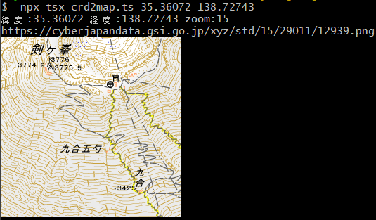
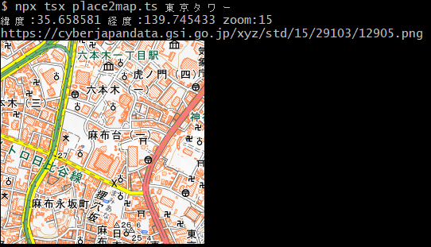

# コンソールに地図を表示するnode.jsアプリ

下記のように緯度経度や、地名からコンソールに地図を表示する(node.js)アプリです




## はじめに

以前の記事[ターミナル内で画像を表示する](https://qiita.com/murasuke/items/5957cd228d5209eea5f9)を応用して、ターミナル内に地図を表示してみたいと思います

## 環境
(Windowsでしか確認していませんが、Sixel対応ターミナルであれば表示できるはず)

* node.js
* sixel対応ターミナル
   * git for windows(のGit Bash)


利用npmライブラリ
* [tsx](https://www.npmjs.com/package/tsx)
* [sixel](https://www.npmjs.com/package/sixel)
* [canvas](https://www.npmjs.com/package/canvas)
* [xml2js](https://www.npmjs.com/package/xml2js)

出典：[地理院タイルについて](https://maps.gsi.go.jp/development/siyou.html)

## ①コンソールに画像を表示するための準備

### 画像をSixel Graphicsに変換する処理を作成します

画像ファイルのパスやURLから画像を読み込み、Sixel形式に変換します

* npmで[sixel](https://www.npmjs.com/package/sixel)をインストール
* [node-sixel](https://github.com/jerch/node-sixel)のサンプルソース[img2sixel.js](https://github.com/jerch/node-sixel/blob/master/img2sixel.js)をもとに、画像を変換する関数(`imgToSixel`)を作成

```typescript:img2sixel.ts
/**
 * image file to sixel converter
 * original
 * https://github.com/jerch/node-sixel/blob/master/img2sixel.js
 */

// set to 16 for xterm in VT340 mode
const MAX_PALETTE = 256;

// 0 - default action (background color)
// 1 - keep previous content
// 2 - set background color
const BACKGROUND_SELECT = 0;

import { loadImage, createCanvas } from 'canvas';
import { image2sixel } from 'sixel/lib/index';

/**
 *
 * @param filename URL or local filename
 * @param palLimit
 * @returns
 */
export async function imgToSixel(filename, palLimit = MAX_PALETTE) {
  // load image
  let img;
  try {
    img = await loadImage(filename);
  } catch (e) {
    console.error(`cannot load image "${filename}"`);
    return;
  }
  const canvas = createCanvas(img.width, img.height);
  const ctx = canvas.getContext('2d');
  ctx.drawImage(img, 0, 0);

  // use image2sixel with internal quantizer
  const data = ctx.getImageData(0, 0, img.width, img.height).data;
  return image2sixel(data, img.width, img.height, palLimit, BACKGROUND_SELECT);
}
```

### 緯度、経度をもとに国土地理院タイルを取得する処理を作成

[国土地理院タイルの仕様](https://maps.gsi.go.jp/development/siyou.html#siyou-zm)に基づき、画像を取得します

詳細はこちらをご確認ください

[緯度、経度をもとに国土地理院タイルを表示する方法](https://qiita.com/murasuke/items/ad81b7b726a3463fa3fe)

```typescript:calc-map-tile.ts
/**
 * 経度から座標(タイルとタイル内pixcel)を計算
 * @param lng 経度
 * @param z zoomlevel
 * @returns
 */
export const calcCoordX = (lng: number, z: number) => {
  // ラジアンに変換
  const lng_rad = (Math.PI / 180) * lng;

  // zoomレベル0の場合、256pxで360度(2PIラジアン)
  //  ⇒ ラジアンあたりpxを計算
  const R = 256 / (2 * Math.PI);

  // グリニッジ子午線を原点とした位置(x) (-128～128)
  let worldCoordX = R * lng_rad;

  // 左端を原点にするために180度分を加算する(0～256)
  worldCoordX = worldCoordX + R * (Math.PI / 180) * 180;

  // 1周256px換算で計算した値にzoomをかけて、zoomで換算した画像の位置を計算
  //  ⇒ https://maps.gsi.go.jp/development/siyou.html#siyou-zm
  const pixelCoordX = worldCoordX * Math.pow(2, z);

  // 1つの画像が256pxなので、256で割って左端からの画像の枚数(タイルの位置)を求める
  // (0オリジンなので切り捨て)
  const tileCoordX = Math.floor(pixelCoordX / 256);

  // 左側のタイル幅合計を引いて、表示タイル内のpx位置を算出する
  const imagePosX = Math.floor(pixelCoordX - tileCoordX * 256);

  // 計算した値を返す
  return {
    worldCoordX,
    pixelCoordX,
    tileCoordX,
    imagePosX,
  };
};

/**
 * 緯度から座標(タイルとタイル内pixcel)を計算
 * メルカトル図法で緯度から位置を算出する式 (https://qiita.com/Seo-4d696b75/items/aa6adfbfba404fcd65aa)
 *  R ln(tan(π/4 + ϕ/2))
 *    R: 半径
 *    ϕ: 緯度(ラジアン)
 * @param lat 緯度
 * @param z zoomlevel
 * @returns
 */
export const calcCoordY = (lat: number, z: number) => {
  // ラジアン
  const lat_rad = (Math.PI / 180) * lat;

  // zoomレベル0の場合、256pxで360度(2PIラジアン)
  //  ⇒ ラジアンあたりpxを計算
  const R = 256 / (2 * Math.PI);

  // メルカトル図法で緯度から位置を算出
  let worldCoordY = R * Math.log(Math.tan(Math.PI / 4 + lat_rad / 2));

  // 赤道からの位置(北緯)で計算しているので、左上を原点とするため軸を逆転＋北極側を原点に換算
  worldCoordY = -1 * worldCoordY + 128;

  // 256px換算で計算した値にzoomをかけて、zoomで換算した画像の位置を計算
  const pixelCoordY = worldCoordY * Math.pow(2, z);

  // 1つの画像が256pxなので、256で割って左端からの画像の枚数(位置)を求める
  // 0オリジンなので切り捨て
  const tileCoordY = Math.floor(pixelCoordY / 256);

  // 上側のタイル幅合計を引いて、表示タイル内のpx位置を算出する
  const imagePosY = Math.floor(pixelCoordY - tileCoordY * 256);

  // 計算した値を返す
  return {
    worldCoordY,
    pixelCoordY,
    tileCoordY,
    imagePosY,
  };
};

/**
 * 指定位置に該当するタイル位置と、該当タイル内の位置を返す
 * @param lat 緯度
 * @param lng 経度
 * @param z zoomlevel
 * @returns
 */
export const calcTileInfo = (lat: number, lng: number, z: number) => {
  // (x, y): 指定位置に該当するタイル位置
  // (pX, pY): 該当タイル内の位置
  const coordX = calcCoordX(lng, z);
  const coordY = calcCoordY(lat, z);
  return {
    x: coordX.tileCoordX,
    y: coordY.tileCoordY,
    pX: coordX.imagePosX,
    pY: coordY.imagePosY,
    z,
  };
};

/**
 * タイルのURLを生成
 * @param x
 * @param y
 * @param z
 * @param dataType
 * @param ext
 * @returns
 */
export const tileUrl = (
  x: number,
  y: number,
  z: number,
  dataType: string,
  ext = 'png'
) => {
  return `https://cyberjapandata.gsi.go.jp/xyz/${dataType}/${z}/${x}/${y}.${ext}`;
};

```


## ②緯度、経度から地図を表示

緯度と経度をパラメータで受け取り、コンソールに表示します

* `calcTileInfo()`で、緯度経度からタイルの位置を取得
* `tileUrl()`で、地理院タイルの画像URLに変換
* `imgToSixel()`で、URLから画像を読み込んでコンソールに表示しています

```
$ npx tsx crd2map.ts 35.658581 139.745433
```


```typescript:crd2map.ts
/**
 * 【経度緯度から地図を表示するコンソールアプリ】
 * $ npx tsx crd2map.ts 35.658581 139.745433
 * ・引数：<緯度> <経度>　<ズームレベル:デフォルト(15)>
 * ・パラメータで渡された「緯度,経度」をもとに、国土地理院の地図(地理院タイル)を取得
 * ・ターミナルに画像表示するためSixel Graphicsに変換
 * ※要Sixel対応ターミナル(mintty, Git Bash)
 */

import { calcTileInfo, tileUrl } from './lib/calc-map-tile';
import { imgToSixel } from './lib/img2sixel';

const lat = 35.36072;
const lng = 138.72743;
const z = 15;
let dataType = 'std';

async function main() {
  let latlng: number[] = [lat, lng, z];
  if (process.argv.slice(2).length >= 2) {
    latlng = process.argv.slice(2).map((value) => parseFloat(value));
    if (latlng.length === 2) {
      latlng.push(z);
    }
  }

  // タイルの位置を取得
  // @ts-ignore
  const { x, y, pX, pY } = calcTileInfo(...latlng);
  const url = tileUrl(x, y, latlng[2], dataType);
  console.log(`緯度:${latlng[0]} 経度:${latlng[1]} zoom:${latlng[2]}`);
  console.log(url);
  console.log(await imgToSixel(url));
}

main();

```

## ③地名から地図を表示する

地名や住所パラメータで受け取り、コンソールに表示します


* `placeToCoord()`で「地名」をwww.geocoding.jpのAPIで緯度経度に変換
* 以降の処理は、②緯度、経度から地図を表示と同じ

```
$ npx tsx place2map.ts 東京タワー
```


```
/**
 * 【住所から地図を表示するコンソールアプリ】
 * $ npx tsx place2map.ts 東京タワー
 * ・引数：<地名、住所>　<ズームレベル:デフォルト(15)>
 * ・パラメータで渡された「地名」をwww.geocoding.jpのAPIで緯度経度に変換
 * ・国土地理院の地図(地理院タイル)を取得
 * ・ターミナルに画像表示するためSixel Graphicsに変換
 * ※要Sixel対応ターミナル(mintty, Git Bash)
 */

import xml2js from 'xml2js';
import { calcTileInfo, tileUrl } from './lib/calc-map-tile';
import { imgToSixel } from './lib/img2sixel';

let z = 15; // デフォルトの
let dataType = 'std';

/**
 * 地名から経度、緯度に変換(www.geocoding.jpのAPIを利用)
 * @param place
 * @returns
 */
async function placeToCoord(place: string) {
  const url = `https://www.geocoding.jp/api/?q=${place}`;
  try {
    const response = await fetch(url);
    const xmlText = await response.text();
    const json = await xml2js.parseStringPromise(xmlText);

    const coord = json.result.coordinate[0];

    return [coord.lat[0], coord.lng[0]];
  } catch (error) {
    throw error;
  }
}

/**
 * 地名から地図を表示する
 * @returns
 */
async function main() {
  if (process.argv.length < 3) {
    return;
  }

  const place = process.argv[2];
  if (process.argv.length == 4) {
    z = parseInt(process.argv[3]);
  }

  const latlng = await placeToCoord(place);
  // タイルの位置を取得
  // @ts-ignore
  const { x, y, pX, pY } = calcTileInfo(...latlng, z);
  const url = tileUrl(x, y, z, dataType);
  console.log(`緯度:${latlng[0]} 経度:${latlng[1]} zoom:${z}`);
  console.log(url);
  console.log(await imgToSixel(url));
}

main();

```
